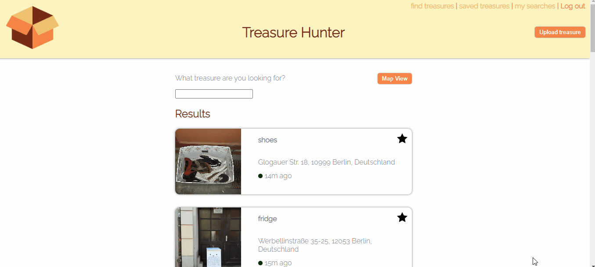
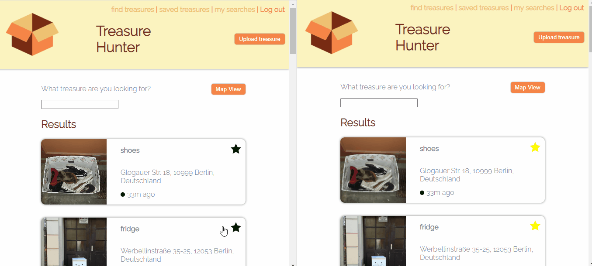

# TREASURE HUNTER

## Description:

Social network allowing users to search, add and delete friends, post compliments on each other’s wall, compliment other online users on a chat and receive real-time notifications.

## Developed with:

-   React
-   React Hooks
-   Node.js
-   Express.js
-   axios
-   Socket.IO
-   Google Maps Javascript API
-   Google Geocoding API
-   Google Places API
-   AWS S3
-   AWS ses
-   PostgreSQL
-   Bcryptjs
-   Cookie-session
-   csurf
-   HTML/CSS

## Features:

Users are welcomed with a page that allows them to register or login, in case they have a profile already.
Users who forgot their password can reset it. An e-mail will be sent with AWS SES to the given address with a random code. The code will be valid only 10 minutes.

Logged in users will see the list of the last uploaded give-away items with the address and how long ago the item was uploaded. A green circle will appear next to the time if the item was uploaded less than 2 hours ago, after 2 hours the circle will turn yellow and red after 6 hours.
The user can **search** for an item by typing in the input field.
The user can switch to **map view** to see the items placed on a map. By clicking on the icon the picture and description as well as the timestamp will appear.

The user can also save a specific search.
When a new item containing the searched item is uploaded, the user will receive a notification. In the **saved searches** page the user can see the saved searches and the search s/he received a notification for will be highlightet. The search box will show the last 3 uploaded items. By clicking on the search box the user will see the updated results for this specific search.

Users can save theit favourite items by clicking on the star. They can see the list of the saved items under **saved treasures**.

Both in map and list view, users can click on the item to open the item page. Here users can leave a **comment** with updates about the item. If a saved items has a new comment the user will receive a **notification**. When opening the saved treasures page, the item with a new comment will be highlighted.

Users can upload pictures of the box with the **upload** button. The user can select the picture, provide a description and an address. Thanks to the **Google Places API** the user can choose the address from the autocomplete suggestions. In this way the address will be correctly formatted for the **Google Geocoding API** to convert it into coordinates.

